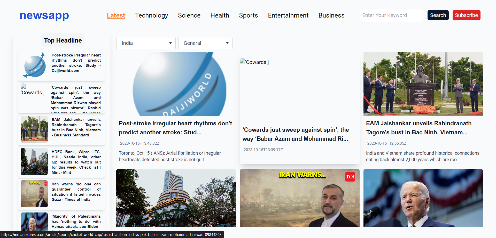

# News Website in Next.js

Welcome to the repository for our News Website, a dynamic platform built using Next.js and dockerized for easy deployment.



## Features

- Dynamic news fetching from news api
- Responsive design for every screen size desktop and mobile size both
- Modern UI/UX
- Docker support for simplified deployment and scalability

## Technologies Used

- **Framework**: Next.js
- **Styling**: Tailwind CSS 
- **APIs**: Newsapi
- **Containerization**: Docker

## Getting Started

### Prerequisites

### Environment variable
  ## MONGODB_URI=
  ## API_KEY=0dbd6f1e68ed462dbdfd56b1a5f8a0f8
  ## NEXT_PUBLIC_FRONTEND_URL=http://localhost:3000

Make sure you have `node.js` and `Docker` installed:

```bash
node v16.18.0
npm 9.4.2
docker 24.0.6


## Installation

1. Clone this repository:

git clone https://github.com/shau8122/news_app.git


2. Move into the project directory:

cd your-repo-name


3. Build the Docker image:

docker build -t news-website-nextjs .

4. Run the Docker container:

docker run -p 3000:3000 news-website-nextjs

5. Visit http://localhost:3000 in your browser to see the application running.

## Without Docker
If you wish to run the project without Docker:

1. Install the project dependencies:

npm install

2. Start the development server:

npm run dev


**Deployment**

You can deploy this Dockerized website on platforms that support Docker containers, or use it in combination with orchestration tools like Kubernetes. If you're deploying the non-Dockerized version, platforms like Vercel or Netlify are recommended. [Read the Next.js documentation on deployment](https://nextjs.org/docs/deployment) for more details.


**Contributing**

If you'd like to contribute, please fork the repository and use a feature branch. Pull requests are warmly welcome.

**License**
Distributed under the MIT License. See `LICENSE` for more information.

**Contact**
Your Name - shaukatali28122001@gmail.com

Project Link: https://news8122.vercel.app
